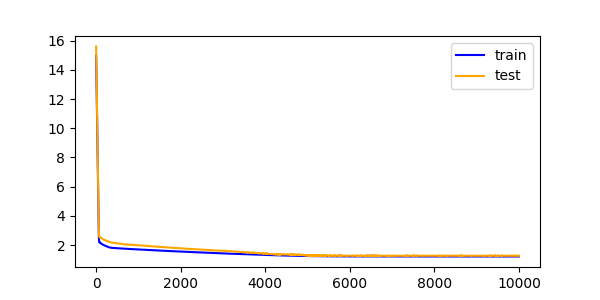
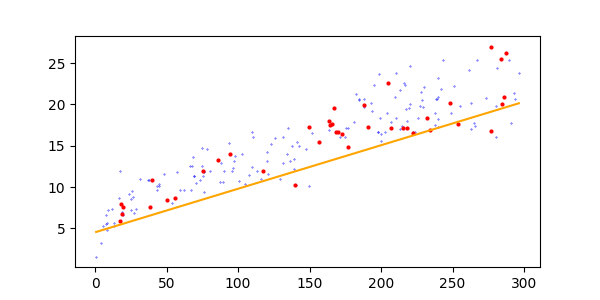

# Linear Regression with PyTorch: Advertisement Dataset

This project demonstrates how to build a simple linear regression model using PyTorch to predict sales based on advertisement budgets for TV, Radio, and Newspaper campaigns. It goes through loading the dataset, splitting it into training and testing sets, defining a custom linear model, and training it using gradient descent.


## Steps Covered

### 1. **Data Preparation**
- We used an advertising dataset containing 200 samples with budgets for three platforms: **TV**, **Radio**, and **Newspaper**.
- Target variable: **Sales**.
- Split the data: 80% for training (160 samples), 20% for testing (40 samples).
- Visualized the relationship between `TV` budgets (a single feature) and sales for both training and testing sets.

### 2. **Custom Linear Model**
- Defined a linear regression model without using PyTorch's built-in `nn.Linear` directly.
- The equation is simple:  
```
y = w^T x + b
```

where:
- `w`: Weights (1 tensor for all features).
- `b`: Bias (a single parameter).

### 3. **Training and Evaluation**
- Trained the model using the **Adam optimizer** with a learning rate of 0.001.
- Loss function: Mean Absolute Error (MAE).
- During training:
    - Calculated the training loss.
    - Evaluated the model on the test set to calculate the testing loss.
    - Logged losses every 100 iterations for better understanding.

### 4. **Visualization**
- Plotted the following:
- Training and testing losses over iterations to check convergence.
- Scatter plots of actual sales vs. TV budgets, overlayed with the trained regression line.


## Results
- The model predicts sales reasonably well for this simple dataset, given a clear linear relationship.
- Losses reduce over iterations, showing effective training.
- The regression line nicely fits the training and testing data for the `TV` feature.


### Visuals
1. **Loss curves**: Track how well the model learns.


2. **Scatter plot with regression line**: See the trained model's predictions.

